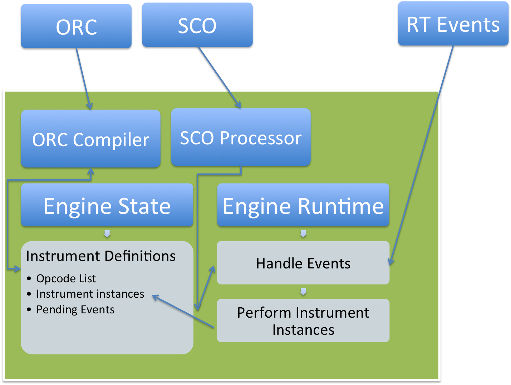
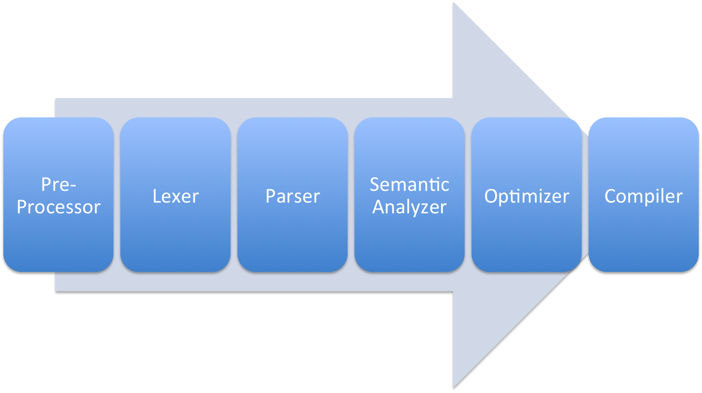

# Csound System Documentation

Steven Yi

## Introduction

...

### Orientation

#### CMake Build System

For Csound 6, we use the [CMake](http://www.cmake.org) build system. CMake is a
meta-build system in that builds project files that are then used with other
build systems. This can produce files for command-line build systems such as
Make or [Ninja](http://martine.github.io/ninja/), as well as build projects for
IDE's such as XCode, Eclipse, or KDevelop.

CMake organizes the build files into ones called CMakeLists.txt. Csound has a
top-level CMakeLists.txt that defines some useful functions, as well as defines
the build for libcsound. From there, other CMakeLists.txt files are included
into the top-level one that has build information for other artifacts, such as
command-line executables, plugin libraries, and GUI applications.

#### Dependencies

Targets: libcsound, Executables, Plugin Libraries, and other Libraries

#### Source Tree Walkthrough

The compiled source lives under `src/`, the tests under `tests/`, and the
documentation under `docs/`. See [ARCHITECTURE.md](../ARCHITECTURE.md) for what
each directory holds and for how the build is laid out.

## High-Level Architecture

The architecture of Csound follows in the tradition of Music-N. In general,
Csound ORC code is used to define *Instruments*, which are then instantiated at
run-time by Csound SCO events, MIDI events, Remote events, or API calls.
Instruments in turn are made up of a series of *Opcodes*, which are the
Unit-Generators of Music-N heritage.

In further detail, Csound Orchestra code is used to define instrument templates.
The ORC code, as text, goes through the Csound Orchestra Compiler, and at the end
is compiled into INSTRTXT instances that are held in a linked-list. The
information held in INSTRTXT instances include information relevant for runtime
instantiation, initiation, and performance of an instrument. This information
includes what opcodes are used and in what order for both initialization and
performance time, what variables are required (including the names of the
variables as well as their types), as well as how the memory for variables and
opcodes are all hooked up to each other.

For traditional Music-N systems that were not capable of accepting realtime
events, a score was used as the single source of events that would trigger
changes to the state of the system, such as initializing new instances of
instruments or creating new function tables. In Csound, this system is still in
place with the processing of SCO code at compile-time, but it also augmented
with the processing of events at runtime. Before run-time, if a Csound SCO block
is passed to the Score compiler, it will be processed, sorted, time-warped, and
re-written as a well-formatted string. This well-formatted string, read in using
the CORFILE mechanism, represented the notes of a note-list composition.

In addition to the well-formatted SCO, realtime events can also affect the state
of the system. In general, the main performance function, kperf(), is used to
process pending events (sensevents()), expire current instances (timeexpire(),
beatexpire()), as well as run active instances. In sensevents(), events that a
processed are new SCO events that have arrived via STDIN pipe, SCO events from
the API (csoundReadScore()), MIDI events, as well as Remote events.

At runtime, kperf() is called once per-audio buffer. The buffer is of ksmps
size. Within that kperf() call, sensevents() is called to update the state of
Csound and active instruments are performed. In general, an application such as
the csound command-line executable or an API host application will repeatedly
call kperf(). Csound will continue to run until an end condition is met: end of
Score, end of MIDI file (if MIDI file was supplied at commandline), encounter of
the 'e' event, or an API application stops Csound.

## Prelude to Processing

### Csound Configuration (Commandline Args/Options)

### ORC/SCO/CSD Input

Text is read through one of two primary paths:

- from files
- from memory

Both of the paths actually filter through the CORFILE system...

## Orchestra Compiler

### Introduction

### Compiler Phases

Csound compiler is separated into a number of distinct phases, as illustrated by
the figure above. The following subsections will discuss each phase of the
compiler. It will include relevant data structures, functions, and files to
consult.

#### CORFIL

The CORFIL mechanism is an implementation of an in-memory file system. ...

#### Pre-Processing

> **Important Files**
>
> Engine/csound_pre.l (Flex file)

The Orchestra Pre-Processor is responsible for processing the following things:

- `#include` - processing to include text from an external file
- `#define` - reading in Orchestra Macro definitions
- `#undef` - un-define a macro
- `$MACRO` - processing Orchestra Macro usages
- `#ifdef`, `#ifndef`, `#else`, `#end` - conditionally include text

The pre-processor is generated using [Flex](http://flex.sourceforge.net/). It is
given text and the expanded processed text is returned (this is done with the
text wrapped in a CORFIL). The call to csound_prelex() is done within
new_orc_parser.c::csoundParseOrc(), with most of the implementation of the
pre-processor utility functions done within csound_pre.l.

#### Lexer

> **Important Files**
>
> Engine/csound_orc.l (Flex file)

The lexing phase reads in a stream of characters and breaks them up into tokens.
(Lexers are also known as *scanners* or *tokenizers*.) Csound uses the
[Flex](http://flex.sourceforge.net/) tool to generate its lexing code. The
source for this is found in Engine/csound_orc.l.

#### Parser

> **Important Files**
>
> Engine/csound_orc.y (Bison file)

The parsing phase uses the tokens generated from the lexing phase and uses rules
defined in a *grammar* to structure the tokens into a TREE. The source for this
is found in Engine/csound_orc.y.

##### History

The parsing code was originally done with hand-written code. This parser was
maintained until Csound 5. While Csound 5 continued stable releases, work began
on a new parser using the [Bison](http://www.gnu.org/software/bison/)
parser-generator tool. In Csound 5.17 (EDIT: Need to check this), the new parser
was enabled by default. For the duration of Csound 5, the old parser could still
be used using a command-line flag.

In Csound 6, the old parser was removed. The parser and compiler were further
developed, though some language issues appeared due to ambiguities between
opcodes and function calls. Also, the design of the parser had aspects of
semantic analysis intertwined, such as knowledge of if an identifier referred to
an opcode or not. Because of the parser's design, it also made some aspects of
language changes difficult.

In Csound 6.xx, a new parser, parser3, was developed. This parser seeked to
remove some of the ambiguities of the previous parser as well as make it easier
to extend the language. The premise of the design was to remove semantic
knowledge from the parser and move it completely to the semantic analysis phase.

#### Semantic Analysis

> **Important Files**
>
> Engine/csound_orc_semantics.c
> Engine/csound_type_system.c
> Engine/csound_standard_types.c

##### Top-Level Statements

##### Statements

##### Type System

##### Lookup

##### Expressions

##### Blocks

##### Compiler

### Runtime Data Structures

Instruments, Opcodes, Instrument Instances, Opcode Instances

#### Labels, Block Expressions

#### Expression Expansion

#### Transactional Compilation

## Score Compiler

#### Event Parsing

#### Score Sorting

---

## Runtime

### Introduction

### Instrument Instance Lifecycle

### Performance

### Scheduler and senseEvents

#### Realtime Events

### SCO

### MIDI

### Channels

## Other Features

### Subinstruments and User-Defined Opcodes

Subinstruments is a feature that allows one instrument to instantiate, run, and
transfer values to/from another instrument instance. This feature was later
modified as the User-Defined Opcode system, which allows users to create new
opcodes using Csound ORC code. Internally, UDO's are stored as instrument
definitions. They are performed in the same manner as an instrument in regards
to there being a linked list of opcodes that are called at init- and
performance-time.

In general, Subinstruments differ from UDO's in that they do not add OENTRY's to
the opcode table. Instead, the subinstr and subinstrinit opcodes are used. These
opcodes will search the list of instrument definitions directly using the
instrum or "instrname" argument given to the opcode. Once found, the
instantiation is done using the instrument definition. On the other hand, UDO's
do add OENTRY's to the opcode table. This allows the name of the UDO to be used
within orchestra code directly as an opcode name, rather than using subinstr and
subinstrinit for all calls to the code.

The UDO system is described below. The primary code for UDO's and Subinstrument
calls are contained within Engine/insert.c.

#### Parsing of UDO's

#### Instantiation of UDO's

##### Interaction of internal state and arguments

#### Performance of UDO's

#### Other Notes

##### Opcode Overloading

## API and Wrappers

## Developer Information

### Csound Testing

The csound6/tests folder contains various forms of tests for Csound. The tests
are generally written to aid development, testing that new code functions as
expected and that they handle errors correctly. The following describes the
various forms of tests.

#### tests/commandline

This folder contains CSD's that get run by a python test runner (test.py). These
are generally used for testing the compiler and can be considered integration
tests. These can be run from the CMake generated build file, i.e. "make
csdtests".

Note: Some tests in the tests/commandline folder are not added to the test
suite. These are generally ones that people have contributed to illustrate a
bug, and were used during debugging. It is useful to have these around and
ideally we will extend the test suite to do runtime testing as well as compiler
testing.

#### tests/c

This folder contains unit tests written in C, using the CUnit library. Currently
there are tests for various parts of the compiler and some API methods. These
tests serve to help ensure we didn't break something moving forward, and also
act as a documentation on how functions are used. These can be run from the
CMake generated tests using "make test" or calling "ctest".
